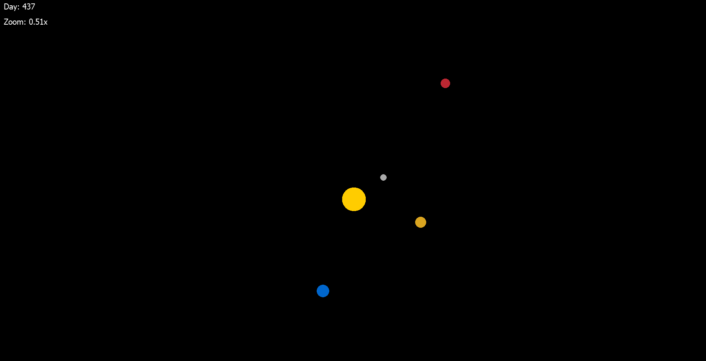

# Solar System Simulation



This is a real-time **Solar System Simulation** written in **Python** using **PyQt5**.  
The application visually represents a simplified model of our solar system, where each celestial body (Sun, planets) follows a calculated orbit based on physics logic.

## 🪐 Features

- **Real-time orbital simulation** of the solar system
- **Accurate planetary data** for mass, distance, and velocity
- **Zoom in and out** with the mouse wheel (`scroll`)
- **Reset view** to default zoom with the `R` key
- **Fullscreen toggle** with `F11`
- Clean and dynamic rendering using `QPainter` and `QPixmap`
- Threaded update system for smooth animation performance

## 🎮 Controls

| Key / Action     | Function                         |
|------------------|----------------------------------|
| `Mouse Wheel`    | Zoom in/out                      |
| `R`              | Reset zoom to default (1.0x)     |
| `F11`            | Toggle fullscreen mode           |
| `Esc`            | Quit the simulation              |

## 🧠 Requirements

- Python 3.x
- PyQt5

Install PyQt5 via pip if you haven't already:

```bash
pip install PyQt5
````

## 🗂️ Structure

```
project/
│
├── main.py                  # Main application window and rendering
├── logic.py                 # Planet class and simulation logic
├── solarsystem.py           # Setup of the solar system (planets, sun)
├── images
└── README.md                
```

## 🚀 How to Run

Run the simulation with:

```bash
python main.py
```
